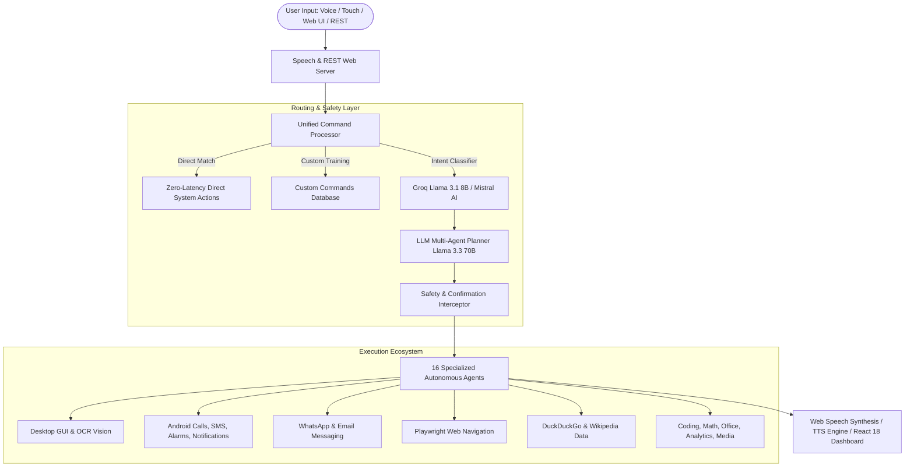

# 🤖 METIS AI Operating System — Executive Presentation & Technical Manual

[](https://www.python.org/)
[](https://react.dev/)
[](https://console.groq.com/)
[](https://developer.mozilla.org/en-US/docs/Web/Progressive_web_apps)
[](LICENSE)

A production-grade, multimodal AI Operating System featuring **16 autonomous agents**, hands-free voice control, computer vision target navigation, Playwright browser automation, cross-platform Android mobile integration, long-term SQLite/MySQL memory, and real-time React 18 telemetry.

---

## 🌟 Key Highlights & Architecture Presentation

### 1. Unified Multimodal Pipeline
Metis processes inputs seamlessly across **Voice (Speech-to-Text)**, **Web UI (React 18 & Babel JSX)**, **Mobile PWA Touch**, and **REST API Endpoints**, routing queries through intent classifiers to specialized agents.

### 2. Dual Cloud & Desktop Execution Mode
- **Local Desktop Mode**: Full OS GUI control, target-based mouse OCR clicking, `pyautogui` automation, and offline `pyttsx3` voice output.
- **Vercel Cloud Serverless Mode**: Lightweight headless execution with lazy module initialization, avoiding native C-compilation dependencies (PortAudio/PyAudio) and X11 `$DISPLAY` crashes.

### 3. Cross-Platform Android Companion
- **Hands-Free Wake Word**: Responsive Web Speech activation ("Hey Metis").
- **ChatGPT Mobile UI**: Clean, full-height dark interface with floating robot visor companion (`METIS [ ⊙ ‿ ⊙ ]`).
- **Mobile Device Protocols**: Direct dialer initialization, SMS drafting, alarm scheduler, and notification intelligence summaries.

---

## 🏗️ System Architecture Diagram



---

## 🛠️ Complete 16-Agent Roster

| Agent Name | Primary File | Capabilities & Sample Voice Commands |
| :--- | :--- | :--- |
| **DesktopAgent** | [agents/desktop_agent.py](file:///c:/Users/Gopi/OneDrive/Desktop/AI%20Desktop%20Voice%20Assistant/agents/desktop_agent.py) | Launches Windows apps (Chrome, Notepad, Calc, VS Code, Task Manager), controls windows, system power, and audio. <br>*"open notepad"*, *"open chrome profile Work"* |
| **VisionAgent** | [agents/vision_agent.py](file:///c:/Users/Gopi/OneDrive/Desktop/AI%20Desktop%20Voice%20Assistant/agents/vision_agent.py) | Takes screenshots, extracts text via OCR, and performs coordinate target-based mouse clicking (`find_and_click_element`). <br>*"read screen"*, *"click submit button"* |
| **MobileAgent** | [agents/mobile_agent.py](file:///c:/Users/Gopi/OneDrive/Desktop/AI%20Desktop%20Voice%20Assistant/agents/mobile_agent.py) | Manages phone calls, SMS drafting, alarm setup, notification summaries, and smart tone rephrasing. <br>*"call Rahul"*, *"set alarm for 6 AM"* |
| **CommsAgent** | [agents/comms_agent.py](file:///c:/Users/Gopi/OneDrive/Desktop/AI%20Desktop%20Voice%20Assistant/agents/comms_agent.py) | Automated WhatsApp Web messaging, email drafting, popup explainer, and command cheat-sheet rendering. <br>*"send whatsapp to Rahul: Meeting at 3 PM"* |
| **BrowserAgent** | [agents/browser_agent.py](file:///c:/Users/Gopi/OneDrive/Desktop/AI%20Desktop%20Voice%20Assistant/agents/browser_agent.py) | Playwright browser navigation, webpage extraction, and automated form filling. <br>*"search google for AI news"*, *"open github.com"* |
| **ResearchAgent** | [agents/research_agent.py](file:///c:/Users/Gopi/OneDrive/Desktop/AI%20Desktop%20Voice%20Assistant/agents/research_agent.py) | Real-time web research via DuckDuckGo, Wikipedia article summaries, and topic comparisons. <br>*"search wikipedia for Quantum Computing"* |
| **CodingAgent** | [agents/coding_agent.py](file:///c:/Users/Gopi/OneDrive/Desktop/AI%20Desktop%20Voice%20Assistant/agents/coding_agent.py) | Generates Python/JS code, explains snippets, fixes tracebacks, checks git status, and executes code safely. <br>*"generate python script for web scraping"* |
| **AutomationAgent**| [agents/automation_agent.py](file:///c:/Users/Gopi/OneDrive/Desktop/AI%20Desktop%20Voice%20Assistant/agents/automation_agent.py) | Parses complex multi-step instructions into JSON UI automation macro sequences. <br>*"open chrome, wait 2 seconds, search weather"* |
| **ConversationAgent**| [agents/conversation_agent.py](file:///c:/Users/Gopi/OneDrive/Desktop/AI%20Desktop%20Voice%20Assistant/agents/conversation_agent.py) | General natural language Q&A fallback invoking Groq / Mistral LLM brain. <br>*"explain how transformer models work"* |
| **CalendarAgent**| [agents/calendar_agent.py](file:///c:/Users/Gopi/OneDrive/Desktop/AI%20Desktop%20Voice%20Assistant/agents/calendar_agent.py) | Google Calendar API integration for listing upcoming events and setting reminders. <br>*"what's on my calendar today"* |
| **OfficeAgent** | [agents/office_agent.py](file:///c:/Users/Gopi/OneDrive/Desktop/AI%20Desktop%20Voice%20Assistant/agents/office_agent.py) | Reads/writes Word (.docx), Excel (.xlsx), PDF (.pdf), and PowerPoint (.pptx) documents. <br>*"read report.pdf"*, *"create report about AI trends"* |
| **AnalyticsAgent** | [agents/analytics_agent.py](file:///c:/Users/Gopi/OneDrive/Desktop/AI%20Desktop%20Voice%20Assistant/agents/analytics_agent.py) | Analyzes CSV/Excel datasets using Pandas, generates Matplotlib charts, and runs SQL queries. <br>*"analyze sales.csv and create bar chart"* |
| **MathAgent** | [math_agent.py](file:///c:/Users/Gopi/OneDrive/Desktop/AI%20Desktop%20Voice%20Assistant/agents/math_agent.py) | Arithmetic, calculus (derivatives/integrals) via SymPy, function plotting, and stats. <br>*"solve equation x**2 - 4 = 0"* |
| **FileAgent** | [file_agent.py](file:///c:/Users/Gopi/OneDrive/Desktop/AI%20Desktop%20Voice%20Assistant/agents/file_agent.py) | Searches files by pattern, organizes Downloads folder, and detects duplicate MD5 hashes. <br>*"organize my Downloads folder"* |
| **MediaAgent** | [media_agent.py](file:///c:/Users/Gopi/OneDrive/Desktop/AI%20Desktop%20Voice%20Assistant/agents/media_agent.py) | HTML5 video & audio player controls (play, pause, rewind, fast forward, full screen, mute). <br>*"play video"*, *"pause video"*, *"full screen"* |
| **InfoAgent** | [info_agent.py](file:///c:/Users/Gopi/OneDrive/Desktop/AI%20Desktop%20Voice%20Assistant/agents/info_agent.py) | Live weather via OpenWeatherMap and tech news via RSS feeds / NewsAPI. <br>*"what is the weather in Mumbai"* |

---

## ⚡ Quick Start & Deployment Guide

### Local Desktop Launch (Windows / Linux / macOS)

```powershell
# 1. Install dependencies
pip install -r requirements.txt

# 2. Configure API Keys
python scripts/save_api_key.py gsk_YOUR_GROQ_KEY_HERE

# 3. Launch METIS AI Operating System
python main.py
```
- Access Desktop Web Dashboard: **[http://localhost:5000](http://localhost:5000)**

### Vercel Serverless Cloud Deployment

```bash
# 1. Install Vercel CLI
npm install -g vercel

# 2. Deploy to Vercel
vercel --prod
```
- Serverless entrypoint automatically routes requests through lightweight Flask WSGI handlers without X11 or audio driver dependency errors.

---

## 📱 Mobile PWA & Android Ecosystem

1. **Install PWA**: Open the web dashboard on Chrome Mobile or Android, tap **Add to Home Screen**, and launch as a standalone application.
2. **Permission Handshake**: On first launch, grant permissions for Microphone, Phone Calls, Contacts, and Notifications.
3. **Hands-Free Speech Synthesis**: Metis answers queries both visually and out loud using Web Speech Synthesis API (`window.speechSynthesis`).

---

## 📊 Real-Time Telemetry & Monitoring

Metis includes a built-in **React 18 Real-Time Monitor** mounted directly on the web interface, rendering:
- **System Metrics**: Live CPU % & RAM % telemetry via `psutil`.
- **Time Zone Sync**: India Standard Time (IST / `Asia/Kolkata` - UTC+5:30) date & time formatting.
- **Database Health**: Active SQLite/MySQL error logs and connection pool status.

---

## 📄 License

This project is open-source and released under the **MIT License**.
