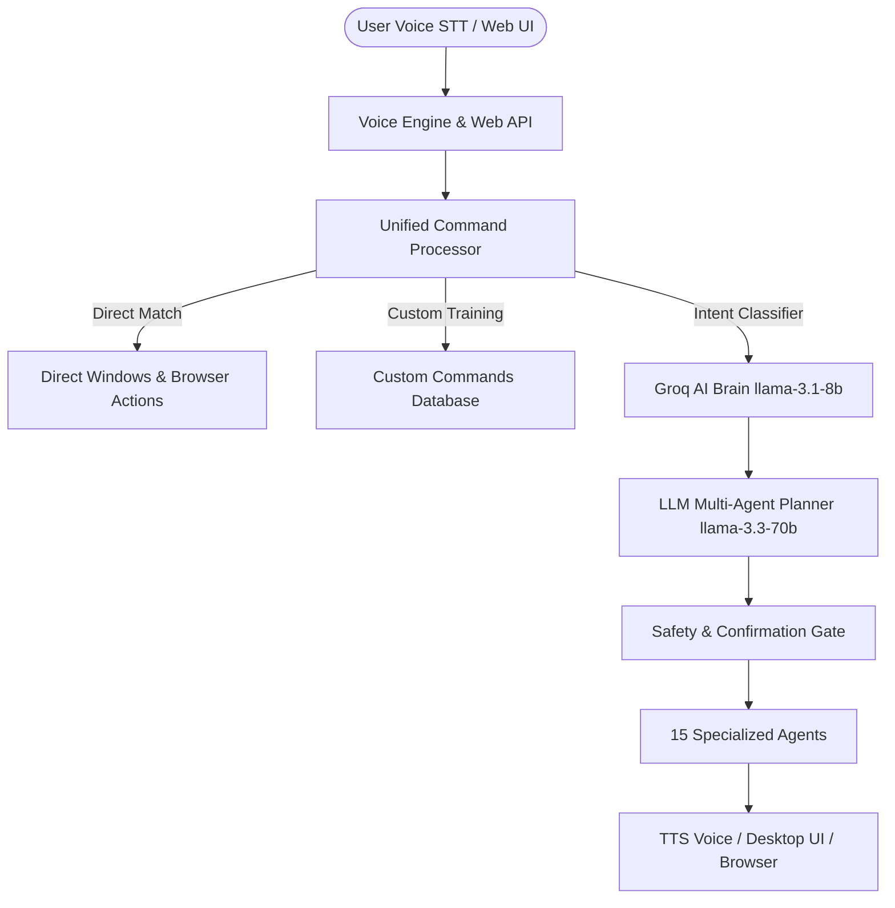

# JARVIS AI Operating System — Technical Documentation & User Manual

A production-ready desktop AI assistant with **15 specialized agents**, voice recognition, vision, Playwright browser automation, Google Calendar, Office documents, data analytics, mathematical engine, and long-term memory.

---

## System Architecture



---

## Quick Start

```powershell
# 1. First-time setup check
python scripts/setup_jarvis.py

# 2. Save your Groq API key
python scripts/save_api_key.py gsk_YOUR_GROQ_KEY_HERE

# 3. Launch JARVIS AI OS
python main.py
```

Web Dashboard: **[http://localhost:5000](http://localhost:5000)**

---

## File-by-File Code Breakdown & Developer Guide

### Core System Files

| File | Purpose & How to Use |
| :--- | :--- |
| [main.py](file:///c:/Users/Gopi/OneDrive/Desktop/AI%20Desktop%20Voice%20Assistant/main.py) | **Main System Entry Point**. Initializes SQLite database, launches background orchestrator thread, starts Tkinter floating visualizer widget, and runs Flask web server on port 5000. <br>`python main.py` |
| [app.py](file:///c:/Users/Gopi/OneDrive/Desktop/AI%20Desktop%20Voice%20Assistant/app.py) | **Web Interface & API**. Implements Flask REST endpoints (`/api/command`, `/api/history`, `/api/train`, `/api/settings/keys`, `/api/voices`) and serves the modern Web Dashboard. |
| [config.py](file:///c:/Users/Gopi/OneDrive/Desktop/AI%20Desktop%20Voice%20Assistant/config.py) | **Configuration Manager**. Loads `.env` environment variables, sets directory paths, voice rates, wake word settings, and database credentials. |
| [database.py](file:///c:/Users/Gopi/OneDrive/Desktop/AI%20Desktop%20Voice%20Assistant/database.py) | **SQLite Database Manager**. Manages `History`, `Settings`, `Users`, and `CustomCommands` tables in `database/assistant.db`. |
| [speech.py](file:///c:/Users/Gopi/OneDrive/Desktop/AI%20Desktop%20Voice%20Assistant/speech.py) | **Speech Module**. Dedicated pyttsx3 worker thread for smooth TTS audio queue output and SpeechRecognition microphone listener. |
| [utils.py](file:///c:/Users/Gopi/OneDrive/Desktop/AI%20Desktop%20Voice%20Assistant/utils.py) | **System Utilities**. System hardware info (CPU, RAM, battery), time/date formatting, fallback app opening, and web search wrappers. |
| [widget.py](file:///c:/Users/Gopi/OneDrive/Desktop/AI%20Desktop%20Voice%20Assistant/widget.py) | **Desktop Siri Visualizer**. Floating transparent Tkinter widget that animates based on state (`idle`, `listening`, `processing`, `speaking`). |

---

### Core Intelligence Engine (`core/`)

| File | Purpose & How to Use |
| :--- | :--- |
| [core/command_processor.py](file:///c:/Users/Gopi/OneDrive/Desktop/AI%20Desktop%20Voice%20Assistant/core/command_processor.py) | **Central Execution Pipeline**. Processes direct zero-latency app commands, WhatsApp protocols, Chrome profile switches, intent classification, and multi-agent plan execution. |
| [core/brain.py](file:///c:/Users/Gopi/OneDrive/Desktop/AI%20Desktop%20Voice%20Assistant/core/brain.py) | **Natural Language Brain**. Uses Groq `llama-3.1-8b-instant` for conversational responses, Q&A, and intent classification. |
| [core/planner.py](file:///c:/Users/Gopi/OneDrive/Desktop/AI%20Desktop%20Voice%20Assistant/core/planner.py) | **LLM Task Planner**. Uses Groq `llama-3.3-70b-versatile` to convert complex multi-step requests into raw JSON agent execution plans. |
| [core/llm_client.py](file:///c:/Users/Gopi/OneDrive/Desktop/AI%20Desktop%20Voice%20Assistant/core/llm_client.py) | **Groq SDK Client**. Shared client interface retrieving API keys dynamically from environment or local SQLite settings. |
| [core/orchestrator.py](file:///c:/Users/Gopi/OneDrive/Desktop/AI%20Desktop%20Voice%20Assistant/core/orchestrator.py) | **Voice Orchestrator Loop**. Daemon thread running microphone listening, wake word detection, and safety gate confirmations. |
| [core/memory.py](file:///c:/Users/Gopi/OneDrive/Desktop/AI%20Desktop%20Voice%20Assistant/core/memory.py) | **Memory System**. Manages short-term conversation context and long-term facts database (`jarvis_memory.db`). |
| [core/safety.py](file:///c:/Users/Gopi/OneDrive/Desktop/AI%20Desktop%20Voice%20Assistant/core/safety.py) | **Safety Gate**. Intercepts destructive actions (file deletion, system shutdown, sending messages) and requires explicit confirmation. |
| [core/learning.py](file:///c:/Users/Gopi/OneDrive/Desktop/AI%20Desktop%20Voice%20Assistant/core/learning.py) | **Usage Tracker**. Analyzes command execution frequencies and suggests automated shortcuts. |
| [core/wake_word.py](file:///c:/Users/Gopi/OneDrive/Desktop/AI%20Desktop%20Voice%20Assistant/core/wake_word.py) | **Wake Word Engine**. Supports optional offline Picovoice Porcupine detection with STT fallback. |

---

### All 15 Specialized Agents (`agents/`)

| Agent | File Path | Capabilities & Example Voice Commands |
| :--- | :--- | :--- |
| **DesktopAgent** | [desktop_agent.py](file:///c:/Users/Gopi/OneDrive/Desktop/AI%20Desktop%20Voice%20Assistant/agents/desktop_agent.py) | Launches Windows desktop apps (Chrome, Notepad, Calc, Paint, VS Code, Cmd, Word, Excel, Task Manager). Controls windows, keyboard, screenshots, and system power. <br>*"open notepad"*, *"open chrome profile Work"*, *"take screenshot"* |
| **BrowserAgent** | [browser_agent.py](file:///c:/Users/Gopi/OneDrive/Desktop/AI%20Desktop%20Voice%20Assistant/agents/browser_agent.py) | Playwright & browser navigation, web searches, webpage text extraction, and automated form filling. <br>*"search google for AI news"*, *"open github.com"*, *"read page"* |
| **CommsAgent** | [comms_agent.py](file:///c:/Users/Gopi/OneDrive/Desktop/AI%20Desktop%20Voice%20Assistant/agents/comms_agent.py) | Gmail inbox opening/composing and automated WhatsApp contact search, chat opening, typing, and message sending. <br>*"open chat with Rahul"*, *"type message Meeting at 3 PM"*, *"send message"* |
| **MediaAgent** | [media_agent.py](file:///c:/Users/Gopi/OneDrive/Desktop/AI%20Desktop%20Voice%20Assistant/agents/media_agent.py) | Website HTML5 video & audio player controls: play, pause, rewind (10s), fast forward (10s), full screen, mute, and Spotify launching. <br>*"play video"*, *"pause video"*, *"forward"*, *"full screen"* |
| **ResearchAgent** | [research_agent.py](file:///c:/Users/Gopi/OneDrive/Desktop/AI%20Desktop%20Voice%20Assistant/agents/research_agent.py) | Web research via DuckDuckGo, Wikipedia article summaries, text summarization, and topic comparisons. <br>*"search wikipedia for Quantum Computing"*, *"summarize this text"* |
| **CodingAgent** | [coding_agent.py](file:///c:/Users/Gopi/OneDrive/Desktop/AI%20Desktop%20Voice%20Assistant/agents/coding_agent.py) | Generates Python/JS code, explains snippets, fixes tracebacks, checks git status, and executes Python scripts locally. <br>*"generate python script to scrape web"*, *"explain this code"* |
| **AutomationAgent**| [automation_agent.py](file:///c:/Users/Gopi/OneDrive/Desktop/AI%20Desktop%20Voice%20Assistant/agents/automation_agent.py) | Parses complex multi-step instructions into JSON UI automation sequences (`type`, `press`, `wait`, `open_app`). <br>*"open chrome, wait 2 seconds, search for weather"* |
| **VisionAgent** | [vision_agent.py](file:///c:/Users/Gopi/OneDrive/Desktop/AI%20Desktop%20Voice%20Assistant/agents/vision_agent.py) | Takes screenshots, performs PyTesseract OCR text extraction, and describes visible screen content. <br>*"read my screen"*, *"describe what is on screen"* |
| **OfficeAgent** | [office_agent.py](file:///c:/Users/Gopi/OneDrive/Desktop/AI%20Desktop%20Voice%20Assistant/agents/office_agent.py) | Reads/writes Word (.docx), Excel (.xlsx), PDF (.pdf), PowerPoint (.pptx), and generates Word reports. <br>*"read report.pdf"*, *"create report about AI trends"* |
| **AnalyticsAgent** | [analytics_agent.py](file:///c:/Users/Gopi/OneDrive/Desktop/AI%20Desktop%20Voice%20Assistant/agents/analytics_agent.py) | Analyzes CSV/Excel datasets using Pandas, generates Matplotlib charts, executes SQLite queries. <br>*"analyze sales.csv and create bar chart"* |
| **MathAgent** | [math_agent.py](file:///c:/Users/Gopi/OneDrive/Desktop/AI%20Desktop%20Voice%20Assistant/agents/math_agent.py) | Arithmetic, algebra, calculus (derivatives/integrals) via SymPy, function plotting, and statistical analysis. <br>*"calculate 2 + 2"*, *"solve equation x**2 - 4 = 0"*, *"plot sin(x)"* |
| **FileAgent** | [file_agent.py](file:///c:/Users/Gopi/OneDrive/Desktop/AI%20Desktop%20Voice%20Assistant/agents/file_agent.py) | Searches files by pattern, detects duplicate files via MD5 hashing, organizes Downloads folder by extension. <br>*"organize my Downloads folder"*, *"find duplicate files"* |
| **InfoAgent** | [info_agent.py](file:///c:/Users/Gopi/OneDrive/Desktop/AI%20Desktop%20Voice%20Assistant/agents/info_agent.py) | Live weather via OpenWeatherMap and tech news via RSS feeds / NewsAPI. <br>*"what is the weather in Mumbai"*, *"latest tech news"* |
| **CalendarAgent**| [calendar_agent.py](file:///c:/Users/Gopi/OneDrive/Desktop/AI%20Desktop%20Voice%20Assistant/agents/calendar_agent.py) | Google Calendar API integration to list upcoming events and set reminders. <br>*"what's on my calendar today"*, *"create reminder for team meeting"* |
| **ConversationAgent**| [conversation_agent.py](file:///c:/Users/Gopi/OneDrive/Desktop/AI%20Desktop%20Voice%20Assistant/agents/conversation_agent.py) | General Q&A fallback agent invoking Groq LLM brain. <br>*"who was Albert Einstein"*, *"explain how neural networks work"* |

---

### External Services (`services/`)

- [services/playwright_helper.py](file:///c:/Users/Gopi/OneDrive/Desktop/AI%20Desktop%20Voice%20Assistant/services/playwright_helper.py): Controls Chrome browser using Playwright for automated search, form filling, and DOM text extraction.
- [services/weather_service.py](file:///c:/Users/Gopi/OneDrive/Desktop/AI%20Desktop%20Voice%20Assistant/services/weather_service.py): OpenWeatherMap API client for temperature, humidity, and wind stats.
- [services/news_service.py](file:///c:/Users/Gopi/OneDrive/Desktop/AI%20Desktop%20Voice%20Assistant/services/news_service.py): Fetches RSS news feeds from BBC and Hacker News with NewsAPI fallback.
- [services/file_intel.py](file:///c:/Users/Gopi/OneDrive/Desktop/AI%20Desktop%20Voice%20Assistant/services/file_intel.py): Fast file search and MD5 duplicate hash detection.
- [services/calendar_service.py](file:///c:/Users/Gopi/OneDrive/Desktop/AI%20Desktop%20Voice%20Assistant/services/calendar_service.py): OAuth2 Google Calendar API service client.

---

## API Keys Reference

| Key | Environment Variable / DB Key | Where to Get | Purpose |
| :--- | :--- | :--- | :--- |
| **Groq API Key** | `GROQ_API_KEY` | [console.groq.com](https://console.groq.com) | AI brain, planner, Q&A (`llama-3.3-70b-versatile`) |
| OpenWeather Key | `OPENWEATHER_API_KEY` | [openweathermap.org](https://openweathermap.org/api) | Weather queries |
| NewsAPI Key | `NEWS_API_KEY` | [newsapi.org](https://newsapi.org) | News headlines (RSS fallback works without key) |
| Picovoice Key | `PICOVOICE_ACCESS_KEY` | [console.picovoice.ai](https://console.picovoice.ai) | Offline wake word detection |

Set keys via `.env` file or **Web UI → Settings**.

---

## Voice Commands Reference Cheat-Sheet

```text
1. Desktop Applications:
   "open notepad"
   "open chrome"
   "open chrome profile Work"
   "open calculator"
   "open paint"
   "open task manager"

2. Video & Media Controls:
   "play video" / "pause video"
   "forward" / "seek forward"
   "rewind" / "seek back"
   "full screen"
   "mute video"

3. WhatsApp Automation:
   "open whatsapp"
   "open chat with Rahul"
   "type message Hello how are you"
   "send message"
   "send whatsapp message to Rahul: Meeting at 3 PM"

4. Web & YouTube Browsing:
   "search youtube for AI tutorials"
   "play lofi music on youtube"
   "search google for Python scripts"
   "open linkedin login page"

5. System Info & Math:
   "system info"
   "what time is it"
   "calculate 73 * 15"
   "solve equation x**2 - 9 = 0"
```

---

## License

MIT License
